<div align="center">

```text
┌────────────────────────────────────────────────────────┐
│ ANISH.OS v3.0                                          │
│ SYSTEM STATUS : ONLINE                                 │
│ LOCATION      : INDIA                                  │
│ ROLE          : BUILDER                                │
└────────────────────────────────────────────────────────┘

Initializing Neural Core... 
████████████████████ 100%

> Backend Systems Loaded
> AI Modules Loaded
> Network Simulation Loaded
> Mission Ready
```


</div>

<br/>


<br/>

## 📡 COMM_LINKS

<div align="center">

[](https://linkedin.com/in/anish06-baskaran)
[](https://github.com/Vampanish)
[](mailto:anish06.baskaran@gmail.com)
[](https://instagram.com/vamp_anish)

</div>

<br/>

## 🧠 NEURAL NETWORK CORE

```text
           [ AI & ML ]
               │
               │
[ NETWORKING ]─●─[ BACKEND ]
               │
               │
         [ SIMULATION ]
```


<br/>

## ⚙️ TECH_MATRIX

<table align="center" style="border-collapse: collapse; text-align: left; font-family: monospace; border: 1px solid #FF003C; background-color: #050505;">
  <tr>
    <td style="padding: 20px; border-right: 1px solid #00F0FF; vertical-align: top;">
      <h3 style="color: #00F0FF; margin-top: 0;">NEURAL PROCESSING</h3>
      ◉ NumPy<br/>
      ◉ Pandas
    </td>
    <td style="padding: 20px; border-right: 1px solid #00F0FF; vertical-align: top;">
      <h3 style="color: #00F0FF; margin-top: 0;">BACKEND MATRIX</h3>
      ◉ Node.js<br/>
      ◉ Express<br/>
      ◉ FastAPI<br/>
      ◉ MongoDB<br/>
      ◉ MySQL<br/>
      ◉ Java / C
    </td>
  </tr>
  <tr>
    <td style="padding: 20px; border-right: 1px solid #00F0FF; border-top: 1px solid #00F0FF; vertical-align: top;">
      <h3 style="color: #00F0FF; margin-top: 0;">NETWORK LAYER</h3>
      ◉ Cisco
    </td>
    <td style="padding: 20px; border-right: 1px solid #00F0FF; border-top: 1px solid #00F0FF; vertical-align: top;">
      <h3 style="color: #00F0FF; margin-top: 0;">DEPLOYMENT GRID</h3>
      ◉ AWS<br/>
      ◉ Firebase<br/>
      ◉ Vercel / Netlify<br/>
      ◉ Docker / Git
    </td>
  </tr>
</table>

<br/>


<br/>

## 🚀 MISSION ACCOMPLISHED

```text
✓ Network Anomaly Simulator
  [ Generating realistic network anomalies and telemetry ]

✓ TCE Sports Scorecard
  [ Real-time sports scoring platform ]

✓ AIPlay
  [ Gamified learning platform for neural networks ]

✓ Health Tourism ChatBot
  [ Regional language healthcare assistance ]

✓ Secure SCADA Framework
  [ Zero Trust + Quantum-Safe Security ]
```

<br/>


<br/>

## 🌌 SYSTEM ACTIVITY MONITOR

<div align="center">
  <picture>
    <source media="(prefers-color-scheme: dark)" srcset="https://raw.githubusercontent.com/Vampanish/Vampanish/output/github-contribution-grid-snake-neon.svg">
    <source media="(prefers-color-scheme: light)" srcset="https://raw.githubusercontent.com/Vampanish/Vampanish/output/github-contribution-grid-snake.svg">
    
  </picture>
</div>

<br/>

## 📊 NEURAL CORE DIAGNOSTICS

```text
╔══════════════════════════════════════════════════════════════════════╗
║ SYSTEM ANALYTICS                                                     ║
╚══════════════════════════════════════════════════════════════════════╝
```

<div align="center">
  
  <br/>
  
</div>

<br/>


<br/>

<div align="center">

```text
[ CONNECTION TERMINATED ]

Thanks for visiting.
See you in the next build.

ANISH.OS shutting down... █
```

</div>
