<div align="center">



</div>

<br/>

<div align="center">
  
</div>

## 🛰️ Communication Channels

<div align="center">

[](https://linkedin.com/in/anish06-baskaran)
[](https://github.com/Vampanish)
[](mailto:anish06.baskaran@gmail.com)
[](https://instagram.com/vamp_anish)

</div>

<div align="center">
  
</div>

<br/>

## 💻 About Me

```bash
$ whoami

Anish
Computer Science Student
Backend Developer
AI Enthusiast

$ mission

Building intelligent systems,
network-scale simulations,
and scalable backend solutions.
```

<br/>

## 📡 Live Command Terminal

```bash
$ currently_building
> Network Anomaly Simulator

$ learning
> Agentic AI
> Distributed Systems

$ interests
> Backend Systems
> Networking
> Artificial Intelligence
> Cyber Security

$ status
> Always Building.
```

<div align="center">
  
</div>

<br/>

## ⚙️ Tech Arsenal

### 🧠 AI & Data
<p>
  
  
</p>

### 🔌 Backend Engineering
<p>
  
  
  
  
  
  
  
</p>

### 📱 Frontend & Mobile
<p>
  
  
  
  
  
  
  
</p>

### ☁️ Cloud & Deployment
<p>
  
  
  
  
  
</p>

### 🛠️ DevOps & Tools
<p>
  
  
  
  
  
  
  
</p>

### 🌐 Networking
<p>
  
</p>

<div align="center">
  
</div>

<br/>

## ☄️ Featured Impact

⚡ **Designed realistic network anomaly simulation framework**
⚡ Built real-time sports score tracking platform
⚡ Developed AI-powered educational applications
⚡ Built healthcare-focused conversational systems
⚡ Presented research at an international conference

<br/>

## 🚀 Flagship Projects

| <br/>🌍 Network Anomaly Simulator<br/><br/> | <br/>🧠 AIPlay<br/><br/> |
| :--- | :--- |
| **Mission:** Generate realistic network anomalies and telemetry.<br/>**Tech:** Python, Networking, Cisco, Telemetry<br/>**Status:** `🟢 Active Development` | **Mission:** Gamified learning platform for neural networks.<br/>**Tech:** Flutter, Firebase<br/>**Status:** `🔵 Completed` |
| <br/>🏆 TCE Sports Scorecard<br/><br/> | <br/>⚕️ Health Tourism ChatBot<br/><br/> |
| **Mission:** Real-time sports scoring platform.<br/>**Tech:** React Native, Node.js, MongoDB<br/>**Status:** `🟡 In Development` | **Mission:** Regional language healthcare assistance.<br/>**Tech:** Gemini API, NLP, Telegram<br/>**Status:** `🔵 Completed` |
| <br/>🔒 Secure SCADA Framework<br/><br/> | |
| **Mission:** Zero Trust + Digital Signatures + Quantum-Safe Security.<br/>**Status:** `🟣 Research` | |

<div align="center">
  
</div>

<br/>

## 🌌 Galactic Activity Monitor

<div align="center">
  <!-- This image will be generated by the .github/workflows/galactic-activity.yml GitHub Action -->
  <picture>
    <source media="(prefers-color-scheme: dark)" srcset="https://raw.githubusercontent.com/Vampanish/Vampanish/output/github-contribution-grid-snake-neon.svg">
    <source media="(prefers-color-scheme: light)" srcset="https://raw.githubusercontent.com/Vampanish/Vampanish/output/github-contribution-grid-snake.svg">
    
  </picture>
</div>

<br/>

## 📊 Neural Core Metrics

<div align="center">
  
  <br/>
  
</div>

<div align="center">
  
</div>

<br/>

## 🔬 Research Lab

**Current Interests:**
* 🧠 Agentic AI
* 🤖 Artificial Intelligence
* 📡 Network Telemetry
* 🌐 Distributed Systems
* 🔒 Cyber Security
* 🧬 Synthetic Data Generation

**Recent Focus:**
* Network Anomaly Simulator
* Secure SCADA Framework
* AI Learning Systems

<br/>

## ⏳ Mission Log

```text
2023 ▸ Programming Foundations
2024 ▸ Mobile Development
2025 ▸ Full Stack Systems
2026 ▸ AI + Network Research
NEXT ▸ Agentic AI Systems
```

<div align="center">
  
</div>

<br/>

<div align="center">

`Mission Control Signing Off...`

`Thanks for visiting.`
`See you among the stars.`

<br/>

[](https://linkedin.com/in/anish06-baskaran)
[](https://github.com/Vampanish)
[](mailto:anish06.baskaran@gmail.com)

</div>
